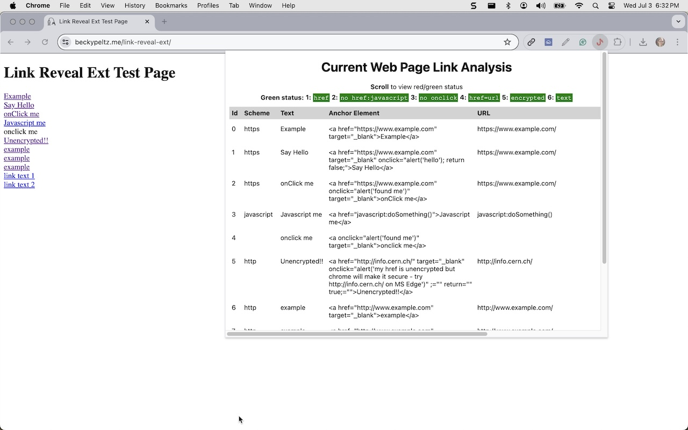
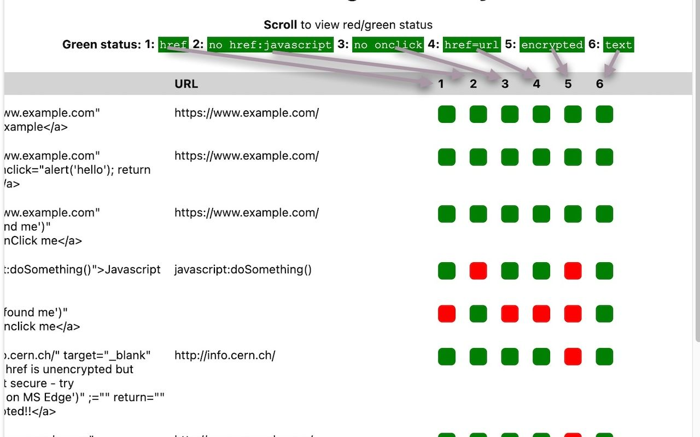

# Link Reveal Ext
The purpose of this chrome extension is to make it easy to see the underlying locations of links rendered as anchor tags on the current web page.  This is intended to help a web page user avoid getting hooked by a phishing exploit.

# Using the Extension

After installing the chrome extension, you will see an icon that has a red fish on a hook in it.

Open a web page for which you want to reveal link information.  You can use the [test page](https://www.beckypeltz.me/link-reveal-ext/) included in this GitHub repository.  It is hosted on GitHub.io.  

Once the web page is loaded, click on the extension icon in the upper right of the Chrome browser.

# Interpreting the Results

Clicking on the extension icon generates a popup window with information about the links on the web page.  You should see a web page that is scrollable in both directions. 
The left most portion provides information about the scheme and text, along with a look at the full rendered anchor tag and the URL that is referenced by the `href` attribute if one exists.

The right most portion provides a look at the "info buttons".  

 

 These buttons are color red and green to provide a quick look at possible security problems.  When there is a possibility that JavaScript is called instead of navigation to a URL value in the href attribute or the URL starts with `http` instead of `https`, implying that the site that the user would navigate to is unencrypted, the button is colored red.

 The numbers in the header captions map to the numbers in the table columns.

 

A red button indicates an attribute or attribute value that could be a security issue, although often it is not.  The red is used when one of the following states are found:
 
 - no `href` attribute: This could be due to the anchor element serving as a button or an onclick used to process a click.  When there is no `href`, there is usually JavaScript that processes the click and this could introduce a security issue.
 - `href:javascript`: When an `href` uses JavaScript it will be calling a function that is has access to instead of navigating to a web page.  This is not usually a security problem, but depending on the JavaScript it could be. 
 - `onclick`: When an `onclick` attribute is added to an anchor tag, it will execute JavaScript.  If the JavaScript returns false, it will continue on and try to navigate to the the URL in the `href`, if there is one.  This is not usually problem but it depends on the JavaScript that is executes.
 - `href:url`:  This is the standard use case for anchor tags that create links for navigation.  It will only appear red if there is no URL.  If there is a URL, look at it to see that it looks valid for the task at hand.  
 - `encrypted`: This is looking at the scheme to see that `https` is used in the URL associated with the `href`.  There can be good reasons for a different scheme, but if the scheme is `http`, this indicates that the URL is not encrypted by default.  Chrome usually encrypts for you, but other browser may not.
 - `text`: In the majority of cases there will be text to describe where a link is navigating you to. If there is no text, it could be due to using an icon or image to describe where the link takes you.  This is something you can see more clearly by looking in the Anchor Element output which shows the full instructions provided by the anchor element.

 The red buttons are not intended to cause alarm, but instead, point to a second look before you click.  

## Credit

Icon: <a href="https://iconscout.com/icons/fish-hook" class="text-underline font-size-sm" target="_blank">fish hook</a> by <a href="https://iconscout.com/contributors/meiliastudio" class="text-underline font-size-sm" target="_blank">Meiliastudio</a>

## Data Flow

## Statistics on Number of Phishing attacks

credit: https://www.thesslstore.com/blog/phishing-statistics/

